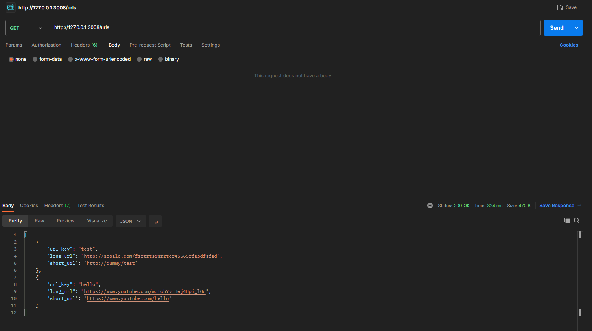

# Node.js URL Shortener

## Overview

This Node.js application is a simple URL shortener. It allows users to create short versions of long URLs, making them easier to share and remember. The app uses Express for the web server and MySQL as the database to store URL mappings.

## Features

- Shorten long URLs into easy-to-share short URLs.
- Prevention of duplicate URLs to ensure uniqueness.

## Getting Started

### Prerequisites

- Node.js and npm installed on your machine.
- MySQL installed and running.

### Installation

1. Clone the repository:

    ```bash
    git clone https://github.com/mzukisimakaluza-dev/url-shortener-backend.git
    ```

2. Change into the project directory:

    ```bash
    cd url-shortener-backend
    ```

3. Install dependencies:

    ```bash
    npm install
    ```

4. Configure environment variables:

    Create a `.env` file in the root directory and set the following variables:

    ```env
    # Database configurations
    MYSQL_HOST='127.0.0.1'
    MYSQL_PORT=3306
    MYSQL_USER='root'
    MYSQL_PASSWORD='root'
    MYSQL_DATABASE='url_shortener'

    # Server configurations
    SERVER_HOST='127.0.0.1'
    SERVER_PORT=3008
    SERVER_DEBUG=true
    ```

    Adjust the values based on your preferences.

5. Initialize the database for local development (ensure the mysql server is running first):

    ```bash
    cd scripts
    ./init_url_shortener_database.sh
    cd ..
    ```

6. Start the application:

    ```bash
    npm start
    ```

6. Access the application in your browser at `http://localhost:3008`.

    Got to http://localhost:3008/urls, you should see a JSON response of the default entries in the DB

## Usage

### Available API Endpoints

1. GET http://localhost:3008/urls - Returns all mappings currently in the DB
2. GET http://localhost:3008/url/https%3A%2F%2Fwww.youtube.com%2Fwatch%3Fv%3DHej48pi_lOc - Returns mapping for long url https://www.youtube.com/watch?v=Hej48pi_lOc
3. POST http://localhost:3008/urls - Creates a single URL mapping in the DB, a request body is needed and should look like this:

```
{
    "long_url": "http://google.com/fsrtrtsrgrrter45565rfgsdfgfgd"
}
```
4. POST http://localhost:3008/shorten - Shortens a URL and writes it to a DB, if it already exists then its just retrieves it. A request body is needed and should look like this:

```
{
    "long_url": "http://google.com/fsrtrtsrgrrter45565rfgsdfgfgd"
}
```

### Shortening a URL

1. Open Postman or other API client you're comfortable with
2. Send a GET http://localhost:3008/urls
3. The server will return all the currently mapped URLs



## FAQ
Some issues reported on Windows and how to fix them:
1. WINDOWS KEY + R, then type msconfig + ENTER
2. Find MYSQL and check if its running, if not

3. Run PowerShell as admin, `> cd "C:\Program Files\MySQL\MySQL Server 8.0\bin"`
4. Optional: `mysqld --install`
5. Run: `mysqld --initialize`

6. WINDOWS kEY + R, then type services.msc, find MYSQL and run it

## Contributing

If you'd like to contribute to this project, please follow these steps:

1. Clone the repository and follow the Getting Started section
2. Create a new branch for your feature: `git checkout -b <initials>_UBS_FEAT_feature-name`
3. Commit your changes: `git commit -m 'USB-<issue_id>: New feature'`
4. Push to the branch: `git push origin <initials>_UBS_FEAT_feature-name`
5. Submit a pull request.

NB: Make sure to rebase onto main branch if you have multiple commits on your PR

## License

This project is licensed under the MIT License - see the [LICENSE](LICENSE) file for details.


